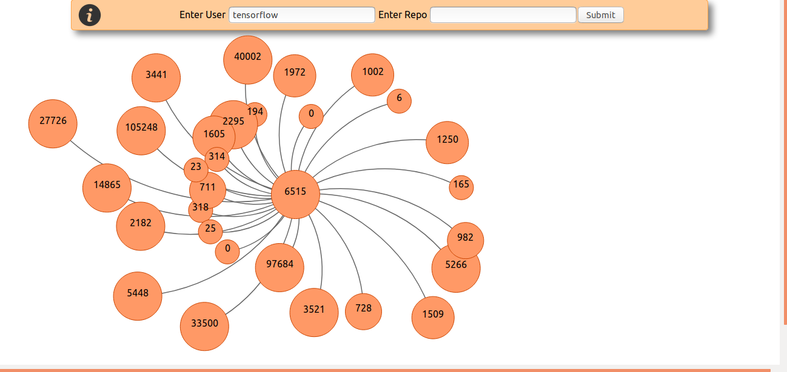
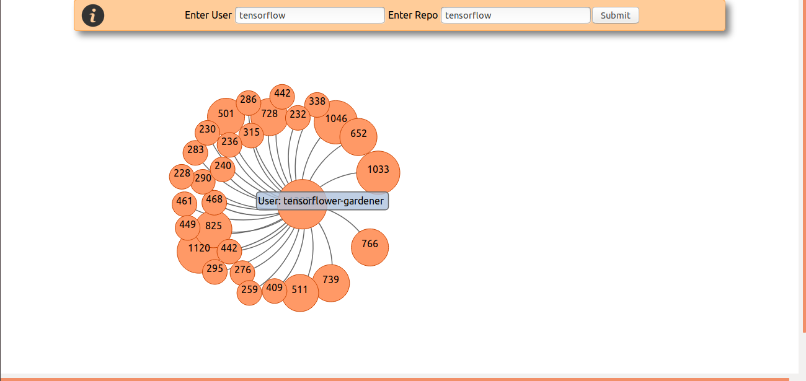
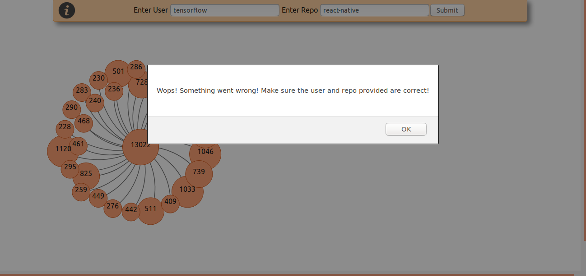
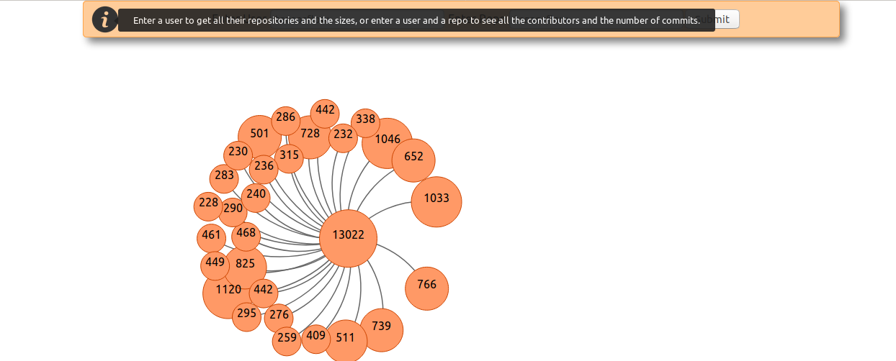

# Github Data Visualization
This project is part of CS3012 Coursework, Trinity College Dublin.
The aim is to interrogate the Github API and fetch data that could be useful in elucidating aspects of the software engineer process. The course requires the data to be used in some sort of visualization.

## Technologies used
1. React
2. D3
3. Node.js
4. NPM

### [React](https://reactjs.org/)
React is a declarative, component-based JavaScript library used for building interfaces.
I used React both for the frontend and fetching the data, with the built-in fetch command.

### [D3](https://d3js.org/)
D3 is another JavaScript library. It's used to build interactive, dynamic web visualization.
I used this library to create a Force-Directed Graph.
**Important** I had to downgrade to a version 3 of D3 because of some backwards compatibilty with one of the methods used for creating the Force-Directed Graph.

### [Node.js](https://nodejs.org/en/)
Node.js is an open-source, cross-platform JavaScript run-time environment that executes JavaScript code outside of a browser.
I used Node.js for the GithubAccess part of the assignment. I started using it in order to fetch the data. I was planning to save this data in MongoDb, but eventually I realized having a database didn't make much sense for my project. I can only simply pull data in React, so I decided to give up on Node.js. Not to mention that using Node.js and React would've required me to learn several other technologies, and I am already new to React and D3.

### [NPM](https://www.npmjs.com/)
npm is a package manager for the JavaScript programming language. I used this on Linux to download all the required packages and to start the React application.

## Project
My project consists of a Force-Directed Graph. In order to populate this graph with data, there are two choices.
1. **Query for user repositories**
If only the user field in the form at the top is supplied then the Graph will show the repositories available for the given user.
The number in the nodes represents the size of a repo. If you hover over a node, you can see the name of the repo.

2. **Query for contributors & number of commits.**
If both the user and the repo field are supplied, then the Graph will show a visualization of the contributors and their respective number of commits. The nodes resize depending on the number of commites they represent. Again if you hover over a node, you can see the name of the user who contributed.

**Error Checking**
In the case that the fetch instructon fails, for various reasons, could be that the API limit has been achieved, or that the supplied repo doesn't belong to a certain user. A message will be displayed that hints at the possible error.

**Help**
In case the interface is confusing, which I hope is not. There is a help button that explains the functionality of the app.

## Install
